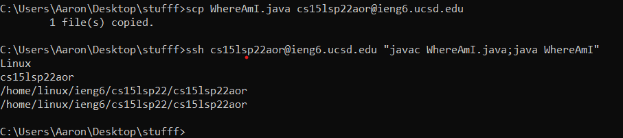

<!----->
# Lab Report 1

I started by downloading the downloader executable for VSCode from the internet. I ran it on my computer and installed VSCode.

I forgot to change my password before the lab so I needed to change my password. After that I started trying to connect to cs**e**15l... instead of cs15l... so I ended up thinking my password change needed more time to take effect. I did pair programming for the rest of the lab with Daniel Miles. I will just post the screenshot we got since I've already set up my ssh keys and can't login with a password anymore (unless I remove the keys).

We tried a couple commands. Mostly we ran `ls` a bunch of times with a bunch of different flags. We also tried other commands like `cat` and `cd` (this screenshot is a recreation on my lab account, I don't have any screenshots of what we did during the lab)

Again, this is recreation. My keys are set up so I don't need to input a password. I just typed `scp <file> <remote>`. `WhereAmI.java` was already there, but now it's been overwritten.

I've circled where the ssh keys are on my lab account. Also before I ran `ls -lat` I was able to log into my lab account without having to input my password.

These are the commands I settled on to optimize my ssh workflow. I first `scp` the file into the server and then `ssh` while running the compile and run commands for the java file I want. It takes a little to type in the beginning but after I've written it once I can just double arrow up.

