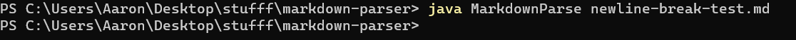
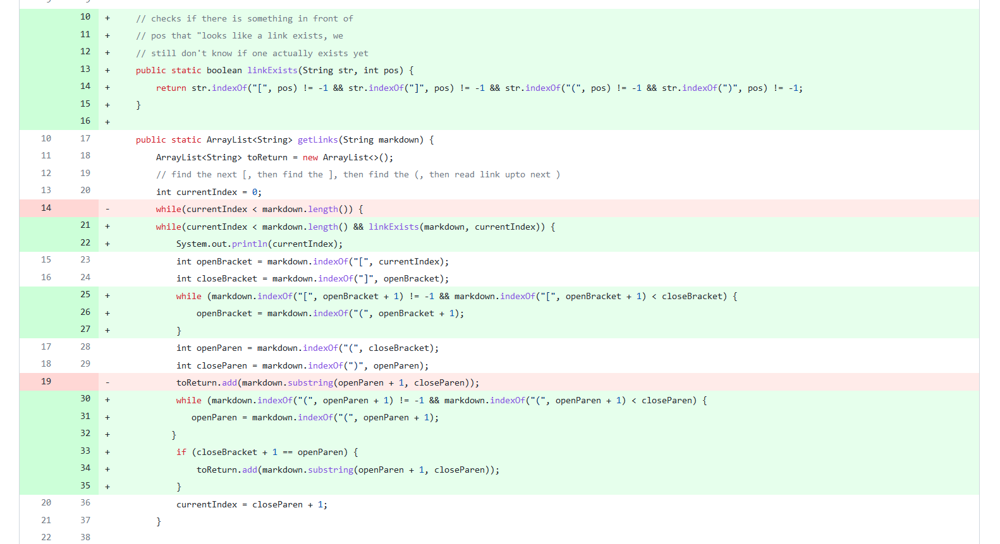
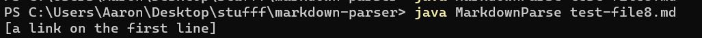
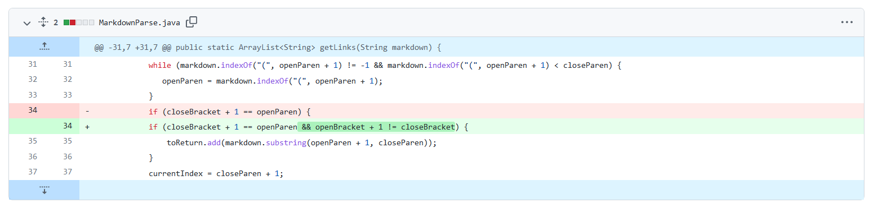

# Lab Report 2

During the week 3 lab I encountered 2 failure inducing inputs. Here are the links to the [nested input](report-2-res/nested-break-test.md) and the [newline input](report-2-res/newline-break-test.md). I don't have the screen shots anymore but I have it written down in the [commit message](https://github.com/doublealiu/markdown-parser/commit/696a29493ccd1105e33d429d02f3e1af0d0defdd) for the nested input that the original program would output the link as:

`[(](https://www.youtube.com/)]`

(Note: I can't actually reproduce this because I had actually modified my code beforehand to solve the test file we were initially given. Thus, the default code actually passes this input but my code did not)

When run on the newline input, the original input wouldn't even output anything. I have it written down in the [commit](https://github.com/doublealiu/markdown-parser/commit/b2f2fdd098b8ccc1ce9ee49f239036f1bd353cdf) that it would simply hang indefinitely until I killed the program.

(You can't tell but I Ctrl-C-ed when it was hanging)

After reading the code for a little, I think almost all the issues just kind of came to me so I ended up just doing one commit for both bugs. I probably shouldn't have done this since I'm prone to write more bugs if I push big commits like this, but I think this time I just felt like I could visualize the solution very easily so I just went for it. Here was the initial code change for these 2 bugs:

I think these 2 failure inducing inputs were pretty simple in terms of debugging. Each symptom of failure corresponded to some specific issue with the program. The reason that the nested test case printed incorrectly was because the program's determinations of what constituted the hyperlink and text components of a markdown link were simply incorrect. The newline test made the program run forever because the terminating condition in the while loop was not strict enough. 

I also encountered a bug in week 4 with the [test-file8.md](report-2-res/code-change.png) file that we were provided as additional tests. Only the test for this file failed for me so I didn't have any pairs of symptoms to cross-reference. The file doesn't actually contain any links but when run the it will print a link anyway:

For my fix I simply had to check for brackets with nothing between them. Here is my commit diff:

Ultimately the symptom and underlying bug that this test case highlighted was pretty straightforward. The symptom was that my program was treating empty brackets as links when it shouldn't have, and the fix was simply to add a check for empty brackets before deciding it was a link. Since the only "tricky" part of the test case was this, it was pretty easy tracking down the unerlying issue in the code.