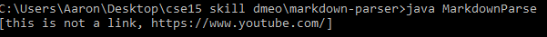

# Lab Report 2

## Input 1
During the week 3 lab one of the failure inducing inputs was this one:

[newline input](report-2-res/newline-break-test.md)

The input was essentially just a file with a link with some more text following it. When run, the program would simply hang indefinitely while reading the input:

(You can't tell but I Ctrl-C-ed when it was hanging)

The commit for this fix is a little more convoluted. I ended up fixing most of the glaring issues with the program in 1 go, even though I should have tried to incrementally test and fix each bug I encountered with my different inputs. The part of the commit that applies to this specific bug was the adding of the `linkExists()` method and its use in the while loop.

The newline test made the program run forever because the terminating condition in the while loop was not strict enough. More specifically, it assumed that the markdown file would just end once it was done reading all the links, which clearly is not always the case. Ultimately this was an isolated symptom, and since the test case didn't trip up the program anywhere else it was pretty clear what the bug was. 

Side note, I call it the newline test because I was inspired by an initial bug with the original test file. During the lab it was announced that the extra newline at the end of the initial test file that was given to us would make the program hang indefinitely since GitHub liked to add new lines at EOF. Thinking about it more I realized I could generalize this case to simply adding anything after the last link to make the program hang.

## Input 2

During the week 3 lab I also encountered another failing input:

[noncontiguous link test](report-2-res/breaking-test.md)

When run the program would incorrectly classify some of the text in the first line as a link:

Again, I ended up writing the fixes for my initial tests in one go. It was not a wise idea in hindsight since it means I have to watch for basically triple the bugs when fixing 3 bugs in one commit, and it doesn't make for understanding which code change corresponded to what bug fix easy. The part of the commit that corresponds to the fix for this was the addition on line 33 of the check for `closeBracket + 1 == openParen`.

I think the reason that this test case printed incorrectly was because the program's determinations of what constituted a link in markdown were in correct. The symptom was that things that were not links were still being printed as links and the bug was simply that the checks weren't tight enough. More specifically, I noticed that one strict rule of markdown links is that the opening parantheses must come right after the closing bracket, which was something that the original program didn't account for.

## Input 3

I also encountered a bug in week 4 with this input:

[test-file8.md](report-2-res/test-file8.md) 

This is the file that we were provided as additional tests. Only the test for this file failed for me so I didn't have any pairs of symptoms to cross-reference. The file doesn't actually contain any links but when run the it will print a link anyway:

For my fix I simply had to check for brackets with nothing between them. Here is my commit diff:

Ultimately the symptom and underlying bug that this test case highlighted was pretty straightforward. The symptom was that my program was treating empty brackets as links when it shouldn't have, and the fix was simply to add a check for empty brackets before deciding it was a link. Since the only "tricky" part of the test case was this, it was pretty easy tracking down the unerlying issue in the code.