# Lab Report 4

Here's a link to [my markdown-parser repo](https://github.com/doublealiu/markdown-parser)

Here's the link to [the one I reviewed in lab](https://github.com/mv5903/markdown-parser)

## Expected Output

First, let's decide on the expected output of each test snippet.

### Snippet 1

Test snippet 1 renders this markdown:

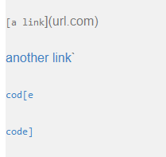

We have 3 links. Thus we expected to get ``[`google.com, google.com, ucsd.edu]`` when we run our tests.

### Snippet 2

Test snippet 2 renders this markdown:

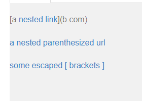

The nested link and the following 2 lines are links. Thus our expected output it `[a.com, a.com(()), example.com]`.

### Snippet 3

Test Snippet 3 renders this markdown:

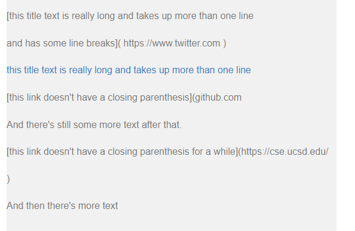

There's only one link, so we expect the output `[https://sites.google.com/eng.ucsd.edu/cse-15l-spring-2022/schedule]`

Now I'm going to start by testing the code of the repository that I reviewed in lab. I only have to show the test code, and show the test output for the repository that I reviewed in lab. Then the rest of the report just involves my repository.

## Other Repository Test

This is the test code that I used for the repository that I reviewed. The snippets are all stored at `lab/snippetX.md`:

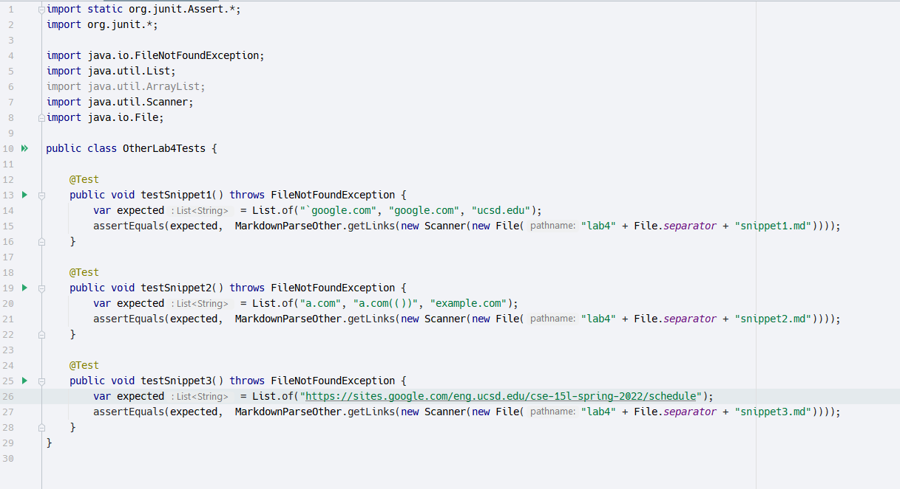

Here are the corresponding test outputs when I run the tests:

### Snippet 1

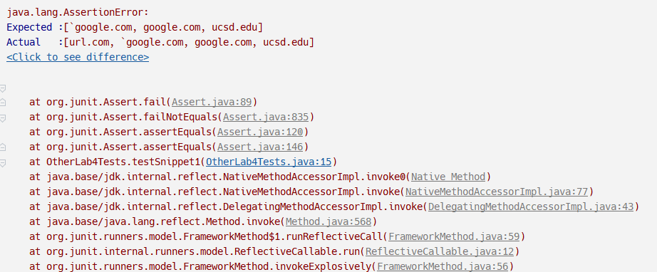

### Snippet 2

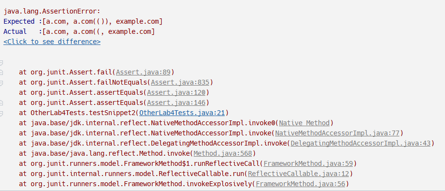

### Snippet 3

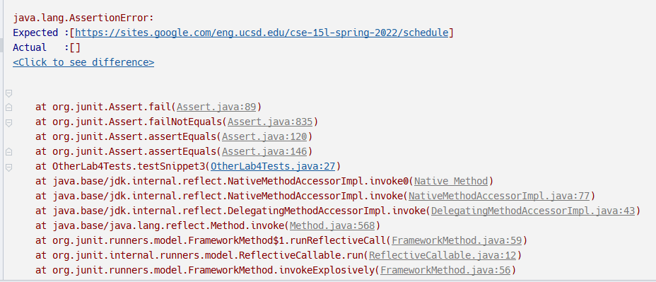

## My Repository

This is the test code that I used for my repository. Once again the snippets are all stored at `lab/snippetX.md`:

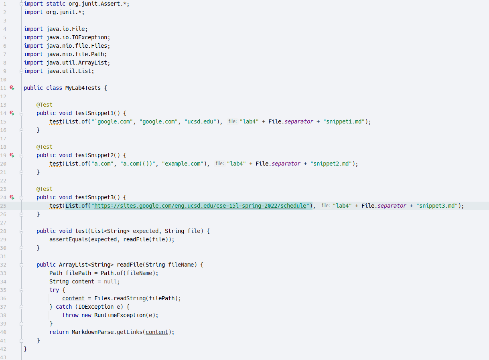

### Snippet 1

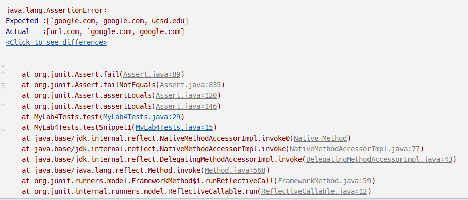

### Snippet 2

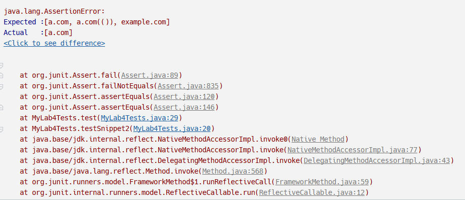

### Snippet 3

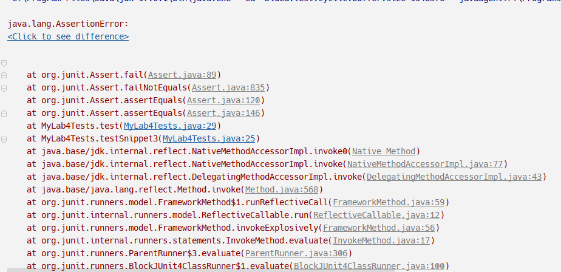

Here is the expected vs. actual:

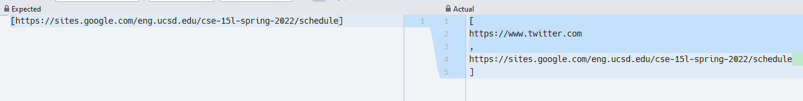

## Questions

### Snippet 1

I can't speak to specifically how long this change will be, but I anticipate it will probably be ~10 lines of code. The reason my program doesn't parse the first test snippet (and related inline backtick cases in general) is because it simply ignores their existence. Brackets and parantheses that are inside backticks make no contribution to a link structure markdown, so the program would have to keep track of the regions (by index of the string) that are occupied by inline backtick delimiters, and then ignore all brackets and parantheses that are inside these inline code blocks. I would fix this by just going through the markdown string in a first pass and mark out where all the inline code blocks are, then parse the links in a second pass, ignoring brackets and parantheses inside a code block.

### Snippet 2

This change will probably take more than 10 lines. The fix for test snippet 2 involves solving 2 separate issues. Firstly, the program needs to be able detect bracket literals, that is `\[` characters, since these characters are meant to simply display a bracket rather than contribute to the structure of a link. The fix for this is simple, when we read a bracket character, we check for a backslash before it.

The second issue is that the program must detect when there are nested parantheses inside the initial parantheses of a link. This corresponds to the `a.com(())` link on the second line in the input. currently, the program simply moves on to the next link once it reads the first `)`, but it should wait until it sees 2 `)`'s before reading the final `)` to close the link. I can fix this by initializing a stack and pushing open parantheses (`(`) to the stack and popping them when it reads closing parantheses. When the program reads a closing paranthese and the stack is empty, we know to end the link.

### Snippet 3

This change will probably be less than 10 lines. The only problem with the program currently in terms of snippet 3 is just that it doesn't account for line breaks in between brackets. To the programs, line breaks (`\n`) are just another character, so it doesn't think that having a line break in the middle of brackets or parantheses makes the link invalid. Thus, all we really need to do it just check the content inside brackets and parantheses to make sure that they do not contain the line break escape character `\n`.