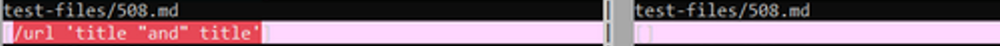
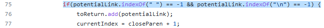

# Lab Report 5

I used the shell script provided to us in the official markdown-parse repository and the pipe operator to pipe the output of all the tests to a text file for both my and the official implementation. Then I used vimdiff on the two files to view test output differences:

On the left is my implementation and on the right is the official implementation.

For the report I've chosen `508.md` and `511.md`.

## 508.md

[Here is the test file](https://github.com/nidhidhamnani/markdown-parser/blob/main/test-files/508.md)

And here is the rendered markdown of the file.

Clearly the expected output should be a list containing just `/url 'title "and" title'`. Here is the diff between my implementation (left) and the public implementation (right).

Again, my implementation is on the left, the public in on the right. According to my screenshot of the `vimdiff`, my implementation is correct while the official implementation is incorrect.

I believe that the reason that the public implementation is wrong is because it explicitly checks for spaces within links and does not count the link if there are spaces inside its URL. More specifically the condition on line 75 seems to be what is causing the issue.

The fix seems to just be removing the condition for there not to be spaces in the URL for the link to count.

## 511.md

[Here is the test file](https://github.com/nidhidhamnani/markdown-parser/blob/main/test-files/511.md)

And here is the rendered markdown of the file.

Clearly the expected output should be a list containing just `/uri`. Here is the diff between my implementation (left) and the public implementation (right).

This time my implementation is incorrect. I believe the issue with my implementation is that when searching for the closed brackets of any link, my code picks the "earliest" appearance of a closed bracket that appears after the open bracket:

Later in my code, after finding the open parantheses of the link structure, my code will then check that the closed bracket and open parantheses are consecutive in the string. If they are not, the link is not counted:

Thus, in the case where we have multiple closed brackets inside the link text like this test, the link will be counted as invalid since what the program "thinks" is the last bracket is not right next to the open parantheses. The fix for this is relatively straightforward (though implementation will probably be a little trickier). The condition for checking link validity should not change, but instead of picking the first closed bracket we see, we should pick the last closed bracket that is still before the open parantheses character.